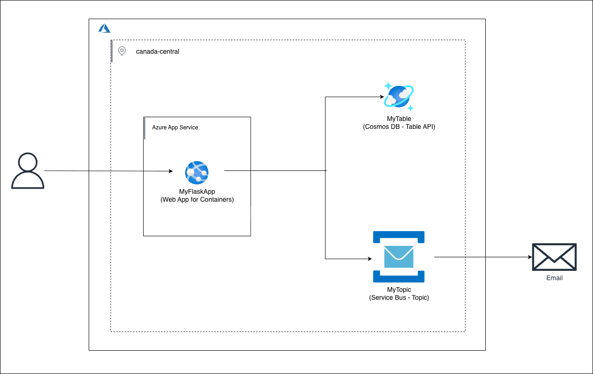

# Lab 9 – Deploying Web Applications Using Azure App Service

## Overview

In this lab, you’ll deploy a **Python Flask web application** using **Azure App Service**, with:

- **Azure Cosmos DB (Table API)** to store user login credentials
- **Azure Service Bus Topic** to publish login notifications
- **Managed Identity** to securely access Azure services without storing secrets
- A workflow equivalent to the AWS lab:
  - **Elastic Beanstalk → Azure App Service**
  - **DynamoDB → Cosmos DB Table API**
  - **SNS Topic → Service Bus Topic**

By the end of this lab, you will be able to:

- Deploy a Flask application using **Azure App Service**
- Store and retrieve records using **Cosmos DB Table API**
- Publish messages to a **Service Bus Topic**
- Package an application for ZIP deployment
- Assign **Managed Identity** permissions via the Azure Portal
- Clean up all resources

---

## Technologies Used

- **Azure App Service (Web App for Linux)**
- **Azure Cosmos DB (Table API)**
- **Azure Service Bus Topic**
- **Managed Identity**
- **Azure Portal**
- **Python 3.10 / Flask**

---

## Architecture Diagram



---

<details>
<summary><b>1️ Create Azure Cosmos DB Table (Equivalent to DynamoDB)</b></summary>

### 1.1 Create Cosmos DB Account

1. In the Azure Portal, search for **“Azure Cosmos DB”**.
2. Click **Create**.
3. Choose **Azure Cosmos DB for Table**.
4. Basics:
   - Subscription: your subscription
   - Resource group: `lab9-rg`
   - Account Name: `lab9cosmosaccount`
   - Location: Canada Central
5. Click **Review + Create → Create**.

---

### 1.2 Create `MyTable`

1. Open your Cosmos DB account: `lab9cosmosaccount`.
2. In the left menu, go to **Tables**.
3. Click **+ Table**.
4. Table name: **MyTable**
5. Click **OK** to create.

---

### 1.3 Insert a Test User (Portal)

1. Inside **MyTable**, click **Items**.
2. Click **+ Add Item**.
3. Add fields exactly like DynamoDB:
   - **PartitionKey:** `Username`
   - **RowKey:** `testuser`
   - **Email:** `test@example.com`
   - **Password:** `pass123`
4. Click **Save**.

This user will be used for login in the Flask application.

</details>

---

<details>
<summary><b>2️ Create Service Bus Topic (Equivalent to SNS Topic)</b></summary>

### 2.1 Create Service Bus Namespace

1. In the Azure Portal, search **Service Bus**.
2. Click **+ Create**.
3. Basics:
   - Resource group: `lab9-rg`
   - Namespace Name: `lab9servicebus`
   - Location: Canada Central
   - Pricing Tier: **Basic**
4. Click **Review + Create → Create**.

---

### 2.2 Create a Topic

1. Open your namespace: `lab9servicebus`.
2. Under **Entities**, select **Topics**.
3. Click **+ Topic**.
4. Name: **MyTopic**
5. Click **Create**.

---

### 2.3 Create Subscription

1. Inside **MyTopic**, click **Subscriptions**.
2. Click **+ Subscription**.
3. Name: `login-subscription`
4. Click **Create**.

This will hold messages published by the Flask app.

</details>

---

<details>
<summary><b>3️ Prepare Flask Application</b></summary>

### 3.1 Application Structure

```
app/
├── application.py
├── requirements.txt
├── templates/
│   ├── index.html
│   └── home.html
└── static/
```

---

### 3.2 requirements.txt

```
Flask==2.3.2
azure-data-tables
azure-servicebus
azure-identity
```

---

### 3.3 application.py

```python
from flask import Flask, render_template, request
from azure.data.tables import TableServiceClient
from azure.servicebus import ServiceBusClient, ServiceBusMessage
from azure.identity import DefaultAzureCredential

app = Flask(__name__)

COSMOS_URL = "https://lab9cosmosaccount.table.core.windows.net"
TABLE_NAME = "MyTable"
SERVICEBUS_NAMESPACE = "lab9servicebus.servicebus.windows.net"
TOPIC_NAME = "MyTopic"

credential = DefaultAzureCredential()

table_service = TableServiceClient(endpoint=COSMOS_URL, credential=credential)
table_client = table_service.get_table_client(TABLE_NAME)

servicebus_client = ServiceBusClient(SERVICEBUS_NAMESPACE, credential=credential)

@app.route('/', methods=['GET','POST'])
def login():
    if request.method == 'POST':
        username = request.form['username']
        password = request.form['password']

        try:
            entity = table_client.get_entity(partition_key="Username", row_key=username)
            if entity["Password"] == password:
                with servicebus_client.get_topic_sender(topic_name=TOPIC_NAME) as sender:
                    sender.send_messages(ServiceBusMessage(f"User {username} logged in"))
                return render_template("home.html")
        except:
            pass

        return render_template("index.html", error="Invalid credentials")

    return render_template("index.html")
```

---

### 3.4 Create ZIP for Deployment

1. Select:
   - `application.py`
   - `requirements.txt`
   - `templates/`
   - `static/`
2. Right-click → **Compress to ZIP**  
   Name it: **FlaskApp.zip**

This ZIP will be deployed to Azure App Service.

</details>

---

<details>
<summary><b>4️ Deploy to Azure App Service (Equivalent to Elastic Beanstalk)</b></summary>

### 4.1 Create App Service Plan

1. In Azure Portal, search **App Service Plans**.
2. Click **+ Create**.
3. Basics:
   - Resource group: `lab9-rg`
   - Name: `lab9-plan`
   - OS: **Linux**
   - Region: Canada Central
   - SKU: **B1**
4. Click **Review + Create → Create**.

---

### 4.2 Create Web App

1. Search **App Services** → **+ Create**.
2. Basics:
   - Resource group: `lab9-rg`
   - Name: `lab9-flaskapp`
   - Publish: **Code**
   - Runtime: **Python 3.10**
   - Operating System: Linux
   - Region: Canada Central
   - App Service Plan: `lab9-plan`
3. Click **Review + Create → Create**.

---

### 4.3 Deploy ZIP File

1. Open Web App → **Deployment Center**
2. Select:
   - Source: **Local Git / ZIP**
   - Build Provider: **App Service Build**
3. Upload **FlaskApp.zip**
4. Click **Save**

Azure will install Python dependencies and start the app.

</details>

---

<details>
<summary><b>5️ Configure Managed Identity Access</b></summary>

### 5.1 Enable Managed Identity

1. Open Web App: `lab9-flaskapp`
2. In left menu, click **Identity**
3. Under **System Assigned**, turn Status → **On**
4. Click **Save**
5. Copy the **Object (Principal) ID**

---

### 5.2 Assign Cosmos DB Permissions

1. Open **lab9cosmosaccount**
2. Go to **Access Control (IAM)** → **Add role assignment**
3. Role: **Cosmos DB Account Reader Role**
4. Assign access to: **Managed Identity**
5. Choose: `lab9-flaskapp`
6. Click **Save**

---

### 5.3 Assign Service Bus Permissions

1. Open **lab9servicebus**
2. Access Control (IAM) → Add role assignment
3. Role: **Azure Service Bus Data Sender**
4. Assign to: `lab9-flaskapp`
5. Click **Save**

Now App Service can access Cosmos DB + Service Bus securely.

</details>

---

<details>
<summary><b>6️ Test the Application</b></summary>

1. Open your Web App URL:

```
https://lab9-flaskapp.azurewebsites.net
```

2. Enter login credentials:

   - Username: `testuser`
   - Password: `pass123`

3. Expected behavior:
   - App checks Cosmos DB Table API
   - If valid → publishes message to **Service Bus Topic**
   - User is redirected to home page

You can view messages in:
**Service Bus → MyTopic → login-subscription → Messages**

</details>

---

<details>
<summary><b>7️ Clean Up</b></summary>

### Delete via Portal

1. Open **Resource Groups**.
2. Select `lab9-rg`.
3. Click **Delete Resource Group**.
4. Type the name to confirm → **Delete**.

This deletes:

- Cosmos DB
- Service Bus
- App Service + Plan
- Any related assets

</details>

---

## Summary

You successfully built the Azure version of the AWS Elastic Beanstalk lab:

- **Azure App Service** replaced Elastic Beanstalk
- **Cosmos DB Table API** replaced DynamoDB
- **Service Bus Topic** replaced SNS
- **Managed Identity** replaced IAM Roles
- Flask application deployed with ZIP
- End-to-end login flow implemented with Azure services

You have completed **Lab 9 – Deploying Web Applications Using Azure App Service**!
